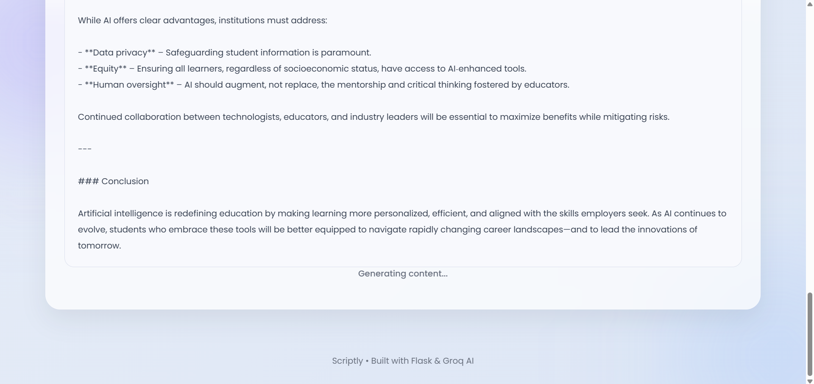

# Scriptly – AI Writing Assistant

Scriptly is an AI-powered writing assistant that helps users generate professional content such as blog posts, emails, social media captions, product descriptions and more.

The application uses Flask for the backend and the Groq API to generate AI-powered content through a simple and user-friendly web interface.

## Features

- Generate AI-powered content from a topic or prompt
- Multiple content types including:
  - Blog Posts
  - Emails
  - Instagram Captions
  - LinkedIn Posts
  - Product Descriptions
  - YouTube Titles
  - Text Rewriting
  - Text Summarization
- Choose different writing tones
- Control the approximate word count
- Copy generated content instantly
- Clean and responsive user interface
- Fast AI responses using Groq

## Tech Stack

- Python
- Flask
- Groq API
- HTML
- CSS
- JavaScript
- python-dotenv

## How It Works

1. The user selects a content type.
2. The user enters a topic or prompt.
3. The user selects the desired tone and word count.
4. The request is sent to the Flask backend.
5. Flask creates a prompt and sends it to the Groq API.
6. The AI-generated content is returned to the web interface.

## Screenshots

##homepage

### Content Generator

### blogpost

